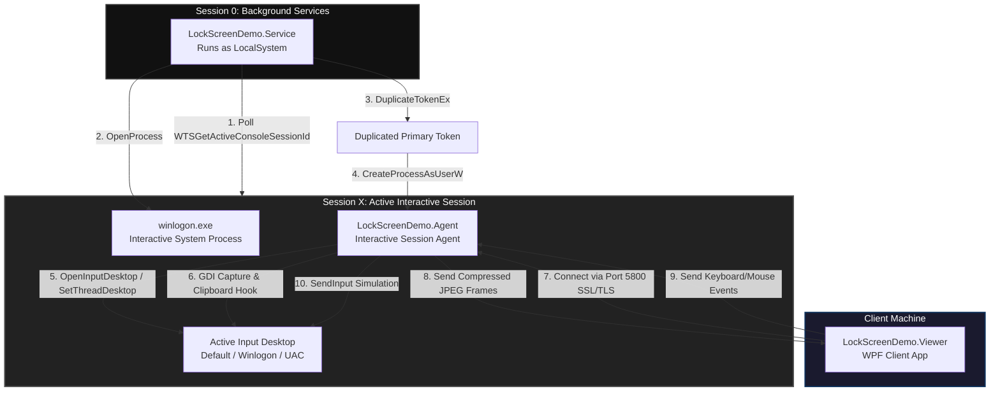

# LockScreenDemo - Windows Lock Screen Access & Remote Control PoC

This project is a high-performance, secure C# (.NET 10) Proof-of-Concept demonstrating the **Windows Service-Agent Session Token Duplication** architecture. It showcases how a system service can spawn an agent inside any interactive session to capture, stream, and control the user interface—even when the workstation is locked, logged out, or displaying a Secure UAC (User Account Control) prompt.

---

## High-Level Architecture Flow

The flowchart below illustrates how the background service monitors sessions, duplicates system tokens, spawns the Agent process, and establishes secure remote control communication:



---

## Core Components

The solution is divided into three key components to enforce proper Windows privilege boundaries:

### 1. Windows Service (`LockScreenDemo.Service`)
* **Privileged Host**: Runs in **Session 0** under the `LocalSystem` security context.
* **Session Monitor**: Continuously polls the active console session ID via Win32 `WTSGetActiveConsoleSessionId`.
* **Token Duplication**: 
  - Locates `winlogon.exe` (running as `SYSTEM` inside the target interactive session).
  - Obtains its primary token and duplicates it with `SecurityImpersonation` levels using `DuplicateTokenEx`.
  - Spawns `LockScreenDemo.Agent` inside the interactive session using `CreateProcessAsUserW`, setting its station and desktop to `winsta0\default`.

### 2. Session Agent (`LockScreenDemo.Agent`)
* **Interactive SYSTEM Access**: Spawned in the interactive user session, giving it access to interact with secure UI elements.
* **Desktop Hook Loop**: Spawns a dedicated thread running `OpenInputDesktop` and `SetThreadDesktop` regularly to dynamically re-attach itself to whichever desktop becomes active (e.g. `Default` for user session, `Winlogon` for locked screen / UAC prompts).
* **SSL Stream Server**: Launches an SSL/TLS socket server on TCP Port `5800` using `SslStream` and an ephemeral, in-memory self-signed certificate.
* **Screen Streamer**: Captures the desktop context using GDI API, compresses the frames into JPEG bytes, and streams them over the network.
* **Input Injection**: Parses received keyboard/mouse packets and translates them into native Win32 `SendInput` calls.
* **Clipboard Hook**: Implements a native clipboard watcher thread to monitor local clipboard modifications and synchronizes text changes to the Viewer.

### 3. Viewer Client (`LockScreenDemo.Viewer`)
* **Operator Console**: A WPF client application styled with a premium dark interface.
* **SSL Client**: Establishes an encrypted SSL socket connection to the Agent at Port `5800` (automatically trusting the self-signed certificate).
* **Viewport Translation**: Decodes screen JPEGs and scales them to fit the client viewport, maintaining aspect ratio while compensating for mouse coordinate translation.
* **Input Handler**: Intercepts mouse movement, scrolling, clicks, and keystrokes, encoding them into simple network packets.
* **Clipboard Synchronization**: Detects operator clipboard updates and forwards them to the remote agent.

---

## Folder Structure

* `LockScreenDemo.slnx` - Visual Studio XML Solution file.
* **`LockScreenDemo.Shared`** - Contains P/Invoke Win32 API declarations (`NativeMethods.cs`) and TCP network packets (`Protocol.cs`).
* **`LockScreenDemo.Service`** - Background Windows service code to monitor sessions and duplicate tokens.
* **`LockScreenDemo.Agent`** - Socket server, GDI capture, input injection, and desktop redirection logic.
* **`LockScreenDemo.Viewer`** - WPF client app codebase.
* `install.ps1` - PowerShell script to build, register, and start the service.
* `uninstall.ps1` - PowerShell script to clean up the service and directories.

---

## How to Install and Run

### Prerequisites

* Windows OS
* .NET 10 SDK or Runtime installed
* Administrator privileges (to register and run Windows services)

### Installation

1. Open a **PowerShell** window.
2. Run the installer script elevated to compile and launch the POC automatically:

   ```powershell
   # Navigate to the LockScreenDemo directory (if not already there):
   # cd path\to\LockScreenDemo
   Start-Process powershell -ArgumentList "-NoProfile -ExecutionPolicy Bypass -File .\install.ps1" -Verb RunAs
   ```

3. The script compiles the solution in Release mode, copies binaries to `C:\ProgramData\LockScreenDemo\bin\`, registers the service, starts it, and launches the **Viewer**.

---

## Verification & Testing

### Test 1: Local Loopback
1. Run the Viewer, enter `127.0.0.1`, and click **Connect**.
2. See your screen rendered inside the Viewer, and control your cursor securely over SSL loopback.
3. Disconnect by clicking **Disconnect** or pressing `Esc`.

### Test 2: Remote VM Testing
1. Install the service on a **Server Virtual Machine (VM)**.
2. Open port `5800` in the Server VM's firewall:
   ```powershell
   New-NetFirewallRule -DisplayName "LockScreenDemo" -Direction Inbound -LocalPort 5800 -Protocol TCP -Action Allow
   ```
3. Copy the compiled WPF Viewer (`LockScreenDemo.Viewer.exe`) to a **Client PC**.
4. Input the VM's IP address in the Viewer and click **Connect**.

### Test 3: Lock Screen & UAC Bypass
1. Connect the Viewer to the Server PC.
2. Lock the Server PC (e.g. click **Lock Windows (Win+L)** inside the Viewer).
3. The display will transition smoothly to the Windows Logon prompt. Type your password/PIN to log back in.
4. Open an administrative command prompt. When the screen dims and the UAC elevation prompt appears, verify that you can see it and click "Yes" remotely.

---

## Troubleshooting & Under-the-Hood Fixes

### Access Violation Crash (Exit Code `3221225794` / `0xC0000005`)

If the service logs report that the spawned agent exited immediately with an Access Violation (`0xC0000005`), the issue was resolved by addressing two system limitations:

1. **Token Impersonation Level**:
   * **Problem**: Spawning processes inside interactive secure desktops (like `Winlogon` or `UAC`) requires a primary token duplicated with at least `SecurityImpersonation` or `SecurityDelegation`. Using `SecurityIdentification` triggers access violations when the .NET runtime queries identity context.
   * **Fix**: Configured `DuplicateTokenEx` to use `SECURITY_IMPERSONATION_LEVEL.SecurityImpersonation`.
2. **Ephemeral Cryptography Keystores**:
   * **Problem**: When generating the self-signed SSL certificate, `X509KeyStorageFlags.MachineKeySet` attempts to save the private key cache to disk. Under a duplicated `SYSTEM` logon session where no full user profile is loaded, disk write permission failures occur.
   * **Fix**: Switched to `X509KeyStorageFlags.EphemeralKeySet` to manage the certificate entirely in memory.

If you make modifications to the source code, redeploy the fix by executing:
```powershell
# Navigate to the LockScreenDemo directory and rerun the installation script:
# cd path\to\LockScreenDemo
Start-Process powershell -ArgumentList "-NoProfile -ExecutionPolicy Bypass -File .\install.ps1" -Verb RunAs
```

---

## How to Uninstall

To clean up, stop, and unregister the service:

1. Open PowerShell.
2. Run the uninstaller:

   ```powershell
   # Navigate to the LockScreenDemo directory (if not already there):
   # cd path\to\LockScreenDemo
   Start-Process powershell -ArgumentList "-NoProfile -ExecutionPolicy Bypass -File .\uninstall.ps1" -Verb RunAs
   ```
